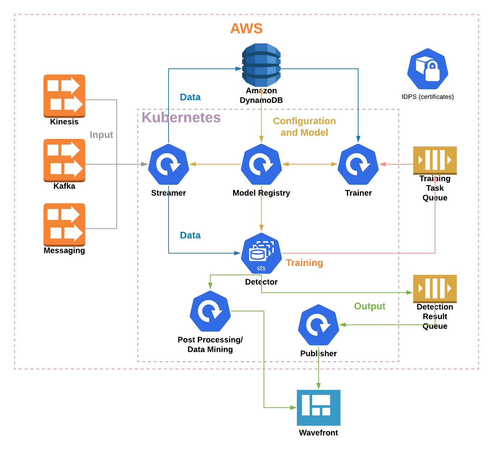
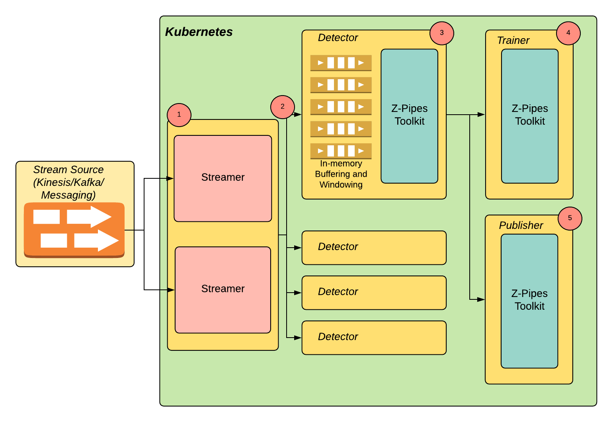
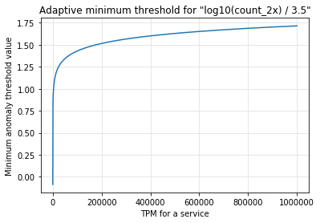

# Anomaly Detection System and Z-Pipes toolkit

(WORK IN PROGRESS)

## 1. Overview

### 1.1 What is the anomaly detection system

The anomaly detection system is a distributed application presently running on Kubernetes that processes streaming metric data and provides the following:
 * ___Identifies abnormalities in a metric or set of metrics received on a stream utilizing pre-trained ML models.___
 * ___Provides a possible explanation of the reason for the discovered anomaly.___
 * ___Publishes a metric score (anomaly score) along with a threshold value and anomaly explanation (like what metric went up or down), that can be used to identify the anomaly level.___
 * ___Does further processing in the form of related metrics data mining(leveraging similarity/distance, and frequent patterns concepts) to discover the general impact and related components affected (presently under development).___
 
In addition, the anomaly detection:
 * _Periodically/continuously trains ML models as per metric or set of metrics that represent an entity (like a service, or deployment partition)._
 * _Is driven by metadata - every pre-processing, detection, or post-processing feature has a simple on-off switch and optional parameters that control the behavior and can be activated/changed by manipulating the metadata values._

### 1.2 What the anomaly detection system is not

The anomaly detection system and the Z-Pipes toolkit are focused on stream processing of metric data, which includes a category of use cases. It assumes that both the training and the detection window data can fit and get processed in memory in Pandas DataFrame with no distributed data sets like RDDs. Therefore, __the anomaly detection system is NOT__:

 * A general purpose ML tool similar to AWS SageMaker, Google AI Platform, Kubeflow, Spark/EMR. In fact, it is expected to be used and pared with some of these platforms, for example when investigating the best algorithm that requires processing and aggregation of millions of records at once.
 * Data streaming and aggregation platform - it is expected the anomaly detection system to receive already aggregated data and to interpret them. This kind of processing is expected to be handled by AWS Kinesis/Kinesis Analytics, Kafka, or other dedicated high-volume processing platform. Again, just like with the previous point, it is expected the anomaly detection system to leverage these platforms.
 * Output/result visualization tool. At present, the outcome of the anomaly detection and the interpretation is published to Wavefront, and this tool charts, dashboards, events and alerts are used to present the result.


### 1.3 What is Z-Pipes
___Z-Pipes___ is the core engine where the calculation logic is developed. It is a simple Python-based toolkit where most of the pre-processing, training and detection, and post-processing logic is built. It is designed to be easily extendable, and to run in both Jupyter notebook for exploration and creating the computational narrative, and in a Kubernetes container in a distributed manner. It also contains simplified visualization functions that help with the presentation and intuition-building. 

The anomaly detection is presently relying on neural network auto-encoders as a primary approach for detecting a metric anomaly. However, the platform is extensible, with the capability to integrate new algorithms and algorithm ensembles.
 
The anomaly detection system tries to introduce and follow a strict process on introducing new features, which first requires producing a computational narrative, where the reasoning why this feature is useful, what are the alternatives etc. are evaluated and presented. The narrative places a strong emphasis on the visualization and building intuition about the solution/feature.

The following figure outlines the main system components that provide the functionality above:




## 2. Stateful architectural pattern

The Anomaly detection system relies on a stateful pattern (2) for passing the stream data from the __streamer components (1)__ to the __detectors (3)__ as demonstrated on the figure below. The pattern is implemented using Kubernetes [StatefulSet](https://kubernetes.io/docs/concepts/workloads/controllers/statefulset/).

Every message on the stream is identified by an entity key (i.e. asset alias, host name, client identifier etc.). The __streamer__ maps each key to a __detector__ instance. This allows every message for an entity key to be associated with just one __detector__, and permits in-memory optimizations - like buffering, windowing, model caching - without reaching constantly to the external storages. If a detector component goes down the data are fetched in memory from the database or model registry just once, then buffered and used from the memory.

__Trainer (4)__ and __publisher (5)__ at this point rely on asynchronous processing patterns when receiving data from the __detector__, since they are built as stateless components.



## 3. Temporal vs. Spatial data concepts - anomaly detection and explanatory engine

The data consumed and interpreted by the components described above are categorized as temporal and spatial. Here is a brief elaboration on how they are used.   

* The data consumed for anomaly detection and impact analysis are two types:
  * Temporal - the time series metrics used to detect anomaly
  * Spatial - hierarchical/graph data used to define dependencies between the individual metrics and used in the explanatory engine.
* Temporal data are utilized as a trigger for interpreting the spatial data
* The spatial data processing is used as follows:
  * To provide higher confidence that the anomaly is real - if the entities up and down the tree are also anomalous
  * To identify and quantify the impact and the location of the problem - i.e. multiple entities are affected, the nodes above or below is affected too


## 4. Z-Pipes toolkit

Z-Pipes is the Python engine in the heart of the anomaly detection system. It can be executed in a Kubernetes container or locally in a Jupyter notebook. It's goal is to be light-weight, non-intrusive, easy to understand and contribute to. It does not prescribe any particular ML framework. However, it should provide clear hooks to integrate with any of them as long as it comes with a Python interface. The current version integrates with [MXNet](https://mxnet.apache.org/api/) and [scikit-learn](https://scikit-learn.org/stable/) and [SciPy](https://docs.scipy.org/doc/scipy/reference/).

__Note: The Anomaly Detection System is not prescriptive for a particular technology or programming language. In the future releases, some of the Detector and Trainer components can be written in GoLang or Scala in case better performance, scalability and thread management is needed.__

### 4.1 Simplicity and speed as main objective

Z-Pipes is based entirely on well-known object-oriented and functional patterns, and follows the traditional pipes-and-filters architecture. The main building blocks are as follow:
 * __Filters__ - processing steps with a single responsibility/purpose. The filter logic is intentionally kept to under a hundred lines of code to provide greater simplicity and modularization.
 * __Adapters__ - provide the integration with the external entities, like Wavefront, data storage like DynamoDB, messaging infrastructure as SQS or ActiveMQ. The adapters provide isolation from how the data are processed and how they are stored and obtained, for example if data are to be retrieved from a data lake and streams consumed from alternative streaming/messaging solution.

The toolkit must allow a proposed ML solution to be researched locally, then quickly wired to the Model registry and pushed to production in a matter of days.

This is an example on how to build an anomaly detection pipeline in Python:

```Python
    # Generate self-signed certificates
    sslGen.gen(KEY, CERT)
    # Define an HTTPS producer that binds to a port
    producer=HttpProducer(PORT,KEY,CERT)
    
    # Build a pipeline
    detectPipeline = Pipeline(
        GetInputFilter(),
        GetConfigsFilter(),
        GetModelsFilter(),
        PreprocessMessageFilter(),
        PredictFilter(),
        PublishResultFilter()
    )
    
    # Build a second pipeline
    modelUpdatePipeline = Pipeline(
        GetKeysTrainFilter(),
        UpdateModelFilter()
    )
    
    # Wire the pipelines to the HTTPS producer
    producer.subscribe_multi({'/notifyDataPoint':detectPipeline,'/notifyModelUpdate':modelUpdatePipeline})
    producer.start()
```

### 4.2 Pandas DataFrame as in-memory data container 

[Pandas](https://pandas.pydata.org/) is an open-source Python data analysis library build on top of Numpy. It is highly optimized to store and process numerical data. In fact, most of the functionality is written in C with a Python layer, therefore, it is truly quick and efficient. One of the main components in Pandas is the [dataframe](https://pandas.pydata.org/pandas-docs/stable/reference/api/pandas.DataFrame.html) - it is roughly equivalent of a table in a relational database, it comes it many statistical, aggregation and other processing functions, it integrates with visualization libraries that allow easy plotting and getting insight about the data. In addition, [Pandas](https://pandas.pydata.org/) provides in memory merging and joining of the [dataframes](https://pandas.pydata.org/pandas-docs/stable/reference/api/pandas.DataFrame.html), which makes it efficient in-memory database. 

[Pandas](https://pandas.pydata.org/) [dataframe](https://pandas.pydata.org/pandas-docs/stable/reference/api/pandas.DataFrame.html) provides easy loading and conversion from/to JSON, XML, HTML, CSV files and in-memory data.

___As a rule, all the Z-Pipes adapters when loading data from an external storage must deliver the records as Pandas dataframe. This makes it extremely convenient to perform statistical calculations and in-memory aggregations. The information exchanged between the filters is recommended to be passed as dataframes.___

### 4.3 Metadata for driving behavior

In Z-Pipes toolkit, every feature linked to processing of streaming data is controlled by a respective metadata entity from the shared or local registry. This allows this feature to be turned on an off quickly without doing a new release and deployment. For example, the features used for training a model are in the following format:  
```json
[
  {
    "featureName": "count_2x",
    "featureSmoothing": [
      "int",
      "log",
      "sqrt"
    ]
  },
  {
    "featureName": "count_4x",
    "featureSmoothing": [
      "int",
      "log"
    ]
  },
  {
    "featureName": "count_5x",
    "featureSmoothing": [
      "int",
      "log"
    ]
  },
  {
    "featureName": "iqr_svcTime",
    "featureSmoothing": [
      "int",
      "log"
    ]
  }
]
```
The above defines the feature name in the input stream, and the transformation to be applied. Once entered in the model  registry, the above is applied in a respective filter when processing a stream record.

## 5. Exploratory-driven process for introducing new features

In order to confidently identify what functionally to be added as the system evolves, the anomaly-detection effort introduces the following three-step process:
 * __Exploratory analysis step(also referred as "computational narrative")__ - this is the story of a feature/capability applied for a target use case, on real metric data, and following strict format(setting an objective, completing options exploration, making a conclusion and recommendation if to proceed with the proposed feature). The exploratory artifact (Jupyter notebook) can be used for reasoning about the capability, building an intuition, and potentially applied even outside of the anomaly-detection system itself. 
 * __Z-pipes functionality implementation step__ - adding the recommended logic from the previous step as classes and functions into Z-pipes toolkit, including one-line visualization capabilities (required for further exploration and intuition-building)
 * __Metadata design and implementation step__ - this part includes determining what parameters to be exposed into the model registry that turn on and off the implemented feature, and linking these attributes to the Z-pipes functions.

Here are examples of computational narratives that are presently part of the Anomaly-detection system:
 * [Explanatory engine]()
 * [Under and oversampling]()
 
The following computational narratives are under development:
 * Leveraging clustering (HDBSCAN) to identify and ignore batch jobs and other periodic anomalies
 * One-class SVM for detecting novelty/outliers in the anomaly-detection output

## 6. Handling highly unbalanced metric data use case

Some systems that exhibit irregular and unpredictable load patterns can present a unique challenge for the anomaly detection system. Long periods of low activity - like a week or two - can be followed with real or simulated intense traffic that represents some event like the Christmas shopping season, Black Friday or a US tax peak. As a result the metric data are highly unbalanced - the high-volume load is for a couple of hours, the low-volume one extends for weeks. 

The following section outlines four solutions to deal with this use case. A separate computational narratives are done for the undersampling/oversampling, and training separate models based on a category.

### 6.1 Adaptive minimum threshold

The adaptive threshold is a simple solution that is activated with a formula set in a service metadata field "thresholdCalc". The minimum threshold value is adjusted based on an average value of a feature from the input stream - like number of HTTP 2xx or total requests. A sample formula is as follows:
```json
"thresholdCalc": "log10(count_2x) / 3.5"
```
The minimum threshold value based on the above formula has the following shape:



This is not a truly intelligent solution, since it does not take into consideration the rest of the metric patterns of the service.

### 6.2 Undersampling and oversampling of the training data

[Undersampling and oversampling](https://en.wikipedia.org/wiki/Oversampling_and_undersampling_in_data_analysis) are used to balance the sample data based on category - i.e. when the load test metrics are underrepresented when training a model they will be balanced against the rest of the samples.

In case of the Tax load testing, the total number of requests per period can be used to assign a category, and use that when preparing the training data.

This feature is explored in a computational narrative, and it will be activated by a metadata value.

### 6.3 Separate models based on data/metric category

This solution again leverages splitting the training data in categories, however, it trains a separate model for each category. The model is activated during the detection when the records from the stream match the category criteria.

This feature will be explored in a separate computational narrative.

### 7. References 

Using autoencoders for detecting anomalies:
- [Introduction to autoencoders](https://www.jeremyjordan.me/autoencoders/)
- [Anomaly detection with Apache MXNet](https://www.oreilly.com/content/anomaly-detection-with-apache-mxnet/)
- [Auto-Encoder: What Is It? And What Is It Used For? (Part 1)](https://towardsdatascience.com/auto-encoder-what-is-it-and-what-is-it-used-for-part-1-3e5c6f017726)

Other technologies used or planned to be used in the Anomaly-detection system:
- [Semi-Supervised Learning](https://www.geeksforgeeks.org/ml-semi-supervised-learning/)
- [How to cluster in High Dimensions](https://towardsdatascience.com/how-to-cluster-in-high-dimensions-4ef693bacc6)
- [How HDBSCAN Works](https://nbviewer.jupyter.org/github/scikit-learn-contrib/hdbscan/blob/master/notebooks/How%20HDBSCAN%20Works.ipynb)
- [OneClassSVM](https://scikit-learn.org/stable/modules/generated/sklearn.svm.OneClassSVM.html)


```python

```
